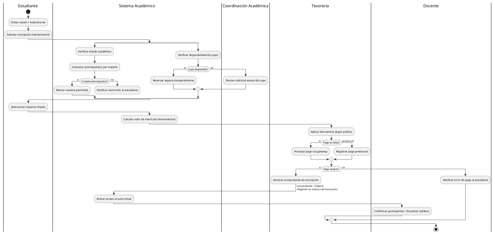

# **DIAGRAMAS DE ACTIVIDADES UML**

**Autores:**  Jairo Andrés Rincón Blanco - Andres Camilo Cuvides Ortega  
**Profesor:** Hely Suarez Marin
**FESC*
---

## **Objetivos**

Diseñar y documentar un Diagrama de Actividades UML que represente el proceso de inscripción a cursos intersemestrales en la FESC tanto en su estado actual (AS-IS) como en una propuesta mejorada (TO-BE), empleando correctamente elementos avanzados del modelado como swimlanes, decisiones, forks/joins, señales, nodos de objeto y pins de entrada/salida, con el fin de analizar, comprender y optimizar el flujo operativo institucional.

---

## **Resumen**

El objetivo de esto, fue modelar el proceso actual (AS-IS) de inscripción intersemestral y proponer una versión optimizada (TO-BE) que reduce pasos manuales, paraleliza validaciones y mejora la experiencia del estudiante. El modelo TO-BE automatiza validaciones de prerrequisitos y asignación de cupos, integra pagos en línea con notificaciones automáticas y centraliza el registro en facturación.

---

## **Actores y Responsabilidades (Swimlanes)**

En el proceso de inscripción participan varios actores con responsabilidades claramente definidas: el Estudiante, quien inicia la inscripción, selecciona las materias y elige el método de pago; el Sistema Académico, encargado de validar los prerrequisitos, verificar los cupos disponibles y registrar las inscripciones; la Coordinación Académica, responsable de aprobar casos especiales y gestionar excesos de cupo; el Docente, que confirma los participantes y actualiza el syllabus; y finalmente Tesorería, que procesa los pagos, genera los recibos y valida los descuentos aplicables.

---

## **Diagramas PlantUML**

### **AS-IS (Proceso Actual)**

---
### **TO BE (Proceso Optimizado)**

```

@startuml TO_BE_Inscripcion_Optimizado
|Estudiante|
start
:Iniciar sesión;
:Solicitar inscripción intersemestral;
|Sistema Académico|
split
  :Auto-validar estado académico (automatizado);
  :Auto-consultar prerrequisitos por materia;
split again
  :Auto-consultar disponibilidad de cupos (caché / API);
end split
join
if (Prerrequisitos OK & Cupo OK?) then (sí)
  |Sistema Académico|
  :Reservar cupo automáticamente (hold);
  :Calcular valor de matrícula + aplicar descuentos automáticos;
  |Estudiante|
  :Confirmar selección y pagar (única pantalla);
  |Tesorería|
  :Procesar pago en línea (integrado, 3DS / gateway);
  if (Pago OK?) then (sí)
    :Generar comprobante y póliza fiscal [Object Node];
    :Registrar en facturación (API);
    |Sistema Académico|
    :Activar acceso al aula virtual (auto-provision);
    |Docente|
    :Recibir notificación y confirmar si aplica;
  else (no)
    :Reintentar pago / Ofrecer conciliación presencial;
  endif
else (no)
  |Sistema Académico|
  :Ofrecer alternativas (espera, prereq, asesoría en línea);
endif
stop
@enduml
```


## **Conclusión**

El modelado **AS-IS** revela un proceso funcional pero con dependencias manuales y cuellos de botella en las validaciones y la gestión de pagos.  
La propuesta **TO-BE** reduce la latencia del proceso a través de **automatización y paralelización** (validaciones automáticas de prerrequisitos y cupos, integración de pagos y facturación, notificaciones automáticas y provisión del aula virtual), resultando en una experiencia de inscripción **más rápida**, **menos propensa a errores** y con **menor carga operativa** para coordinación y tesorería.

